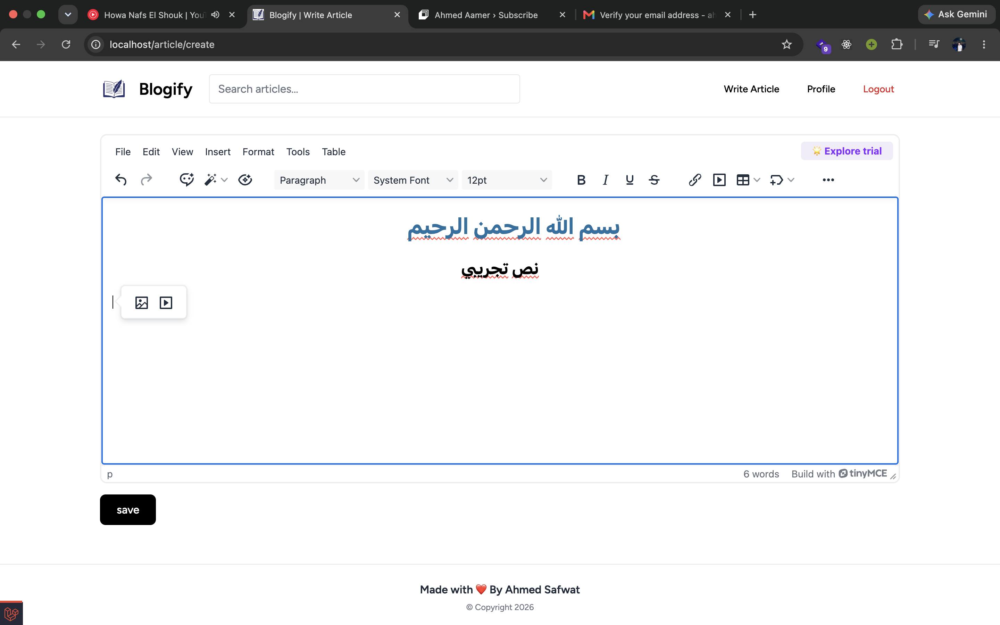
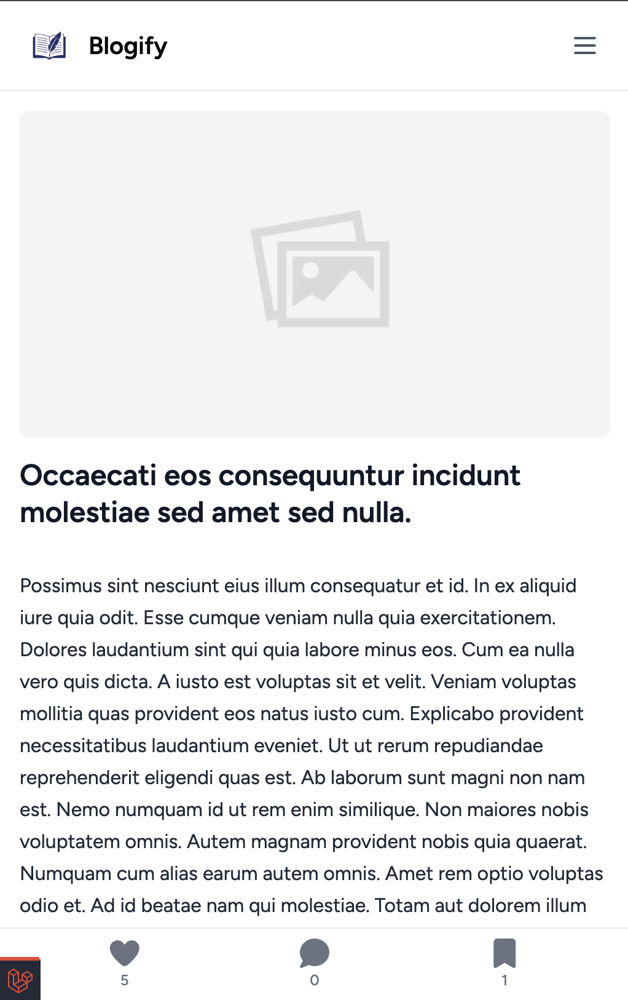
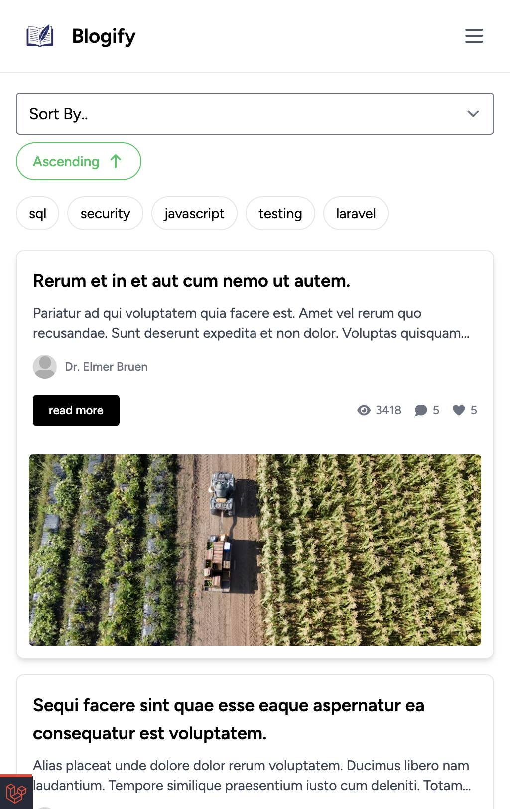
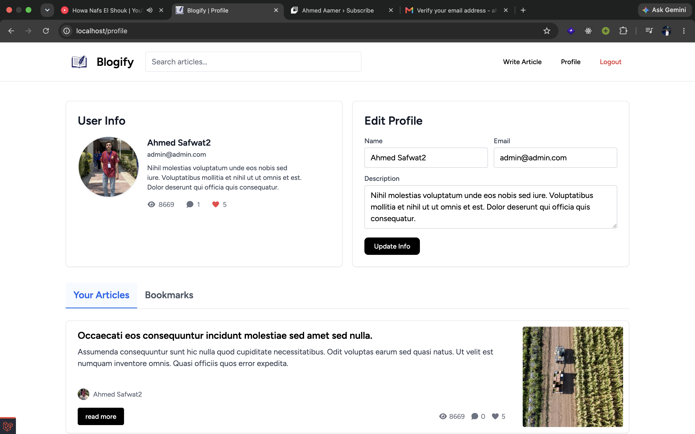

```markdown
# 📝 Blogify

**Blogify** is a modern web-based blogging platform designed for reading, publishing, and interacting with articles. It offers a seamless experience for creators and readers to engage through likes, comments, bookmarks, and author subscriptions.

---

## 🌟 Features

* ✍️ **Article Publishing:** Easy-to-use interface for writing and managing blog posts.
* 🔍 **Search & Sorting:** Quick article search and filtering functionality.
* 💬 **User Interactions:** Engagement features including likes and comments.
* 🔖 **Bookmarks:** Save articles to read later.
* 👤 **Author Follows:** Subscribe to favorite authors to stay updated.
* 📱 **Responsive Design:** Fully responsive UI crafted with Tailwind CSS.

---

## 📸 Screenshots

Here are previews of the project's interface:

```markdown





```

---

## 🛠️ Tech Stack

* **Back-end:** [Laravel](https://laravel.com) (PHP)
* **Front-end:** Blade Templates, [Tailwind CSS](https://tailwindcss.com), JavaScript
* **Build Tool:** [Vite](https://vitejs.dev)
* **Database:** MySQL / PostgreSQL

---

## 🚀 Getting Started

Follow these steps to get a local copy up and running.

### Prerequisites

Ensure you have the following installed on your machine:

* PHP >= 8.1
* Composer
* Node.js & NPM
* MySQL or PostgreSQL

### Installation

1. **Clone the repository**
```bash
git clone [https://github.com/safwat92/blogify.git](https://github.com/safwat92/blogify.git)
cd blogify

```


2. **Install PHP dependencies**
```bash
composer install

```


3. **Install JavaScript dependencies**
```bash
npm install

```


4. **Environment Setup**
   Copy the example environment file and generate the application key:
```bash
cp .env.example .env
php artisan key:generate

```


5. **Configure Database**
   Open the `.env` file and update your database credentials:
```env
DB_CONNECTION=mysql
DB_HOST=127.0.0.1
DB_PORT=3306
DB_DATABASE=blogify
DB_USERNAME=root
DB_PASSWORD=

```


6. **Run Migrations**
```bash
php artisan migrate

```


7. **Start Development Servers**
   Run the Laravel backend server:
```bash
php artisan serve

```


In a separate terminal, run Vite for asset compilation:
```bash
npm run dev

```


8. Open your browser and navigate to `http://127.0.0.1:8000`.

